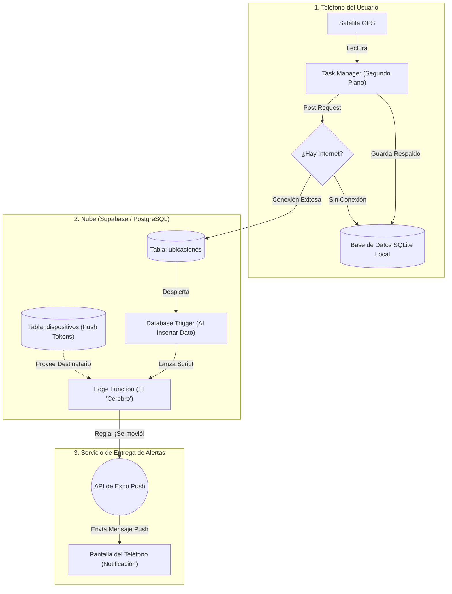

# 📍 Rastreador GPS Offline-First

Aplicación móvil construida con **React Native** (Expo) diseñada para capturar, almacenar y sincronizar datos de geolocalización en tiempo real, con una arquitectura altamente resiliente a la falta de conectividad a internet.

## 🚀 Características Principales

*   **Rastreo en Segundo Plano:** Utiliza `expo-location` y `expo-task-manager` para seguir capturando el trayecto del usuario incluso cuando la pantalla está apagada o la aplicación minimizada.
*   **Arquitectura Offline-First:** Toda coordenada capturada se guarda inmediatamente en una base de datos **SQLite local** dentro del dispositivo, garantizando cero pérdida de datos en zonas sin cobertura.
*   **Sincronización en la Nube:** Conectada a **Supabase (PostgreSQL)**. Al tener conexión a internet, los datos fluyen instantáneamente a la base de datos centralizada.
*   **Identificación Silenciosa:** Cada dispositivo genera y almacena un UUID persistente (`AsyncStorage`) para identificar las rutas de distintos usuarios sin requerir un inicio de sesión manual.
*   **Push Tokens:** Preparada para recibir alertas (ej: geocercas, movimiento anómalo) conectando el token del dispositivo a las *Edge Functions* de Supabase.

---

## 🛠️ Tecnologías Utilizadas

*   **Frontend:** React Native, Expo SDK 54, React Navigation.
*   **Base de Datos Local:** SQLite (Modo WAL activado para alta concurrencia de lectura/escritura).
*   **Backend / Nube:** Supabase (BaaS sobre PostgreSQL).
*   **Notificaciones:** Expo Notifications.
*   **Distribución:** EAS Build (Generación de `.apk`).

---

## 📱 ¿Cómo funciona el flujo de datos?

1.  El satélite GPS detecta un cambio de ubicación (configurado a 10 metros o 10 segundos).
2.  La tarea de segundo plano (`locationTask.ts`) es despertada por el sistema operativo.
3.  Se guarda el punto en `ubicaciones.db` (SQLite local).
4.  En la misma fracción de segundo, se intenta hacer un *Insert* hacia la tabla `ubicaciones` en Supabase. Si falla por falta de internet, el dato queda respaldado localmente.

### Arquitectura de Sistema



---

## ⚙️ Requisitos para la Nube (Supabase)

Para desplegar este proyecto, debes crear las siguientes tablas en tu instancia de Supabase (sin Row Level Security para etapa de pruebas):

**Tabla `ubicaciones`**
*   `id` (int8) - Primary Key
*   `dispositivo_id` (text)
*   `latitud` (float8)
*   `longitud` (float8)
*   `fecha_hora` (timestamptz)

**Tabla `dispositivos`**
*   `dispositivo_id` (text) - Primary Key
*   `push_token` (text)

---

## 💻 Desarrollo Local

Para correr este proyecto en tu entorno local:

1. Clona este repositorio.
2. Instala las dependencias:
   ```bash
   npm install
   ```
3. Inicia el servidor de desarrollo de Expo:
   ```bash
   npx expo start
   ```
4. Usa la aplicación **Expo Go** en tu dispositivo físico para escanear el código QR (los simuladores no son recomendados para probar GPS en segundo plano ni notificaciones push).

---

## 📦 Compilación de APK (Android)

Para generar un archivo instalable para distribución en Android:
```bash
eas build -p android --profile preview
```
